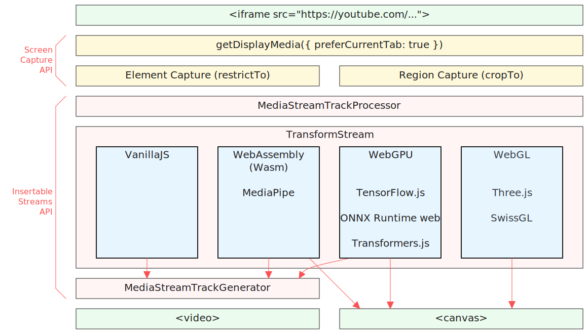

# LordTubeMaster
### Live YouTube processing in client-side JS using self screen capture

Demo: https://eyaler.github.io/LordTubeMaster/#dQw4w9WgXcQ

Note as of September 2024 this is only supported on *Chromium desktop*.

Enable graphics/hardware acceleration browser setting to reduce lag.
Particularly for the WebGPU examples - make sure you are using a discrete GPU.

For fullscreen zoom of output (with right-click) enable: `chrome://flags/#element-capture` (*Google Chrome*), or 
`chrome://flags/#enable-experimental-web-platform-features` (*Chromium*).

You can browse the effects with `Alt+↑` and `Alt+↓`

The code demos usages with Wasm ([MediaPipe](https://ai.google.dev/edge/mediapipe/solutions/guide)),
WebGPU ([TensorFlow.js](https://www.tensorflow.org/js), [ONNX Runtime Web](https://onnxruntime.ai/docs/get-started/with-javascript/web.html), [Transformers.js](https://huggingface.co/docs/transformers.js/index)),
WebGL ([Three.js](https://threejs.org/), [SwissGL](https://google.github.io/swissgl/)), and VanillaJS.

Known issues:
1. Modnet crashes using Transformers.js v3-alpha on Chromium 129+: https://github.com/xenova/transformers.js/issues/943 (I currently reverted to v2 causing a significant slowdown)
2. Resolution of captured media is doubled for smaller frames: https://github.com/screen-share/element-capture/issues/44

 

[Demo video](https://github.com/eyaler/LordTubeMaster/assets/4436747/2352969c-889d-478e-b386-8bdf6452a797)

 

