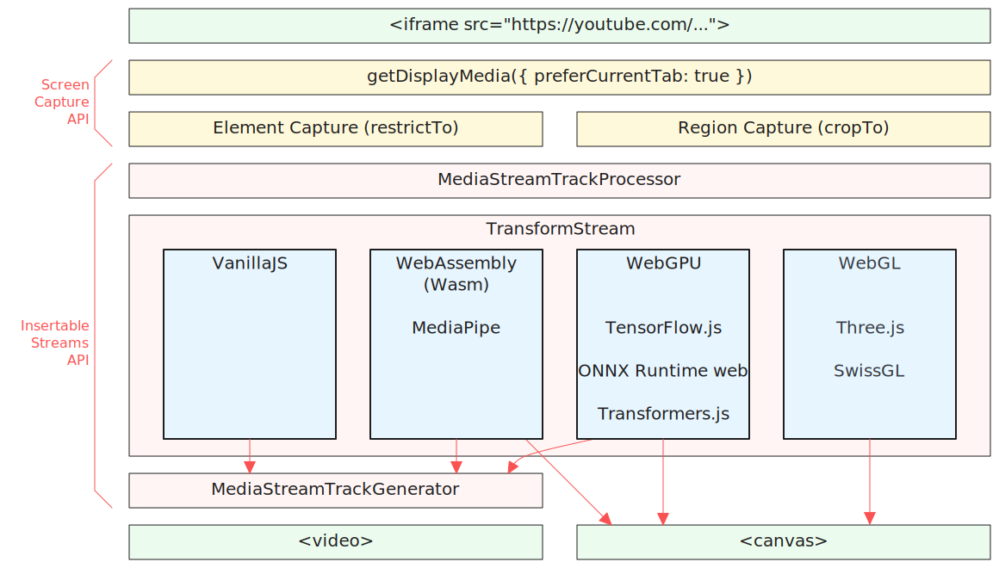

# LordTubeMaster
### Live YouTube processing in client-side JS using self screen capture

Demo: https://eyaler.github.io/LordTubeMaster/#dQw4w9WgXcQ

Note as of late 2024 this is only supported on *Chromium desktop* (e.g. Chrome, Edge).

Enable graphics/hardware acceleration browser setting to reduce lag.
Particularly for the WebGPU examples - make sure your system graphics settings for the browser uses high performance / discrete GPU.

To allow fullscreen zoom of output (with right-click) enable: `chrome://flags/#element-capture` (*Google Chrome 121+*), or 
`chrome://flags/#enable-experimental-web-platform-features` (*Chromium 121+*), and relaunch the browser.

You can browse the effects with `Alt+↑` and `Alt+↓`

The code demos usages with Wasm ([MediaPipe](https://ai.google.dev/edge/mediapipe/solutions/guide)),
WebGPU ([ONNX Runtime Web](https://onnxruntime.ai/docs/get-started/with-javascript/web.html), [TensorFlow.js](https://www.tensorflow.org/js), [Transformers.js](https://huggingface.co/docs/transformers.js/index)),
WebGL ([Three.js](https://threejs.org/), [SwissGL](https://google.github.io/swissgl/)), and VanillaJS.

#### Known issues:
1. Resolution of captured media is doubled for smaller frames: https://github.com/screen-share/element-capture/issues/44

 

#### Demo video:

(Using RTX 3070 Ti laptop @ 1920x1080)

[Demo Video](https://github.com/user-attachments/assets/1e03f147-b229-4d9f-a340-ea8969830e50)

 

#### High-level architecture and implemented modules:

 

Exhibited in <a href="https://fubar.space/2024/artist-list/#0105">/'fu:bar/</a> glitch art festival exhibition in 2024.
